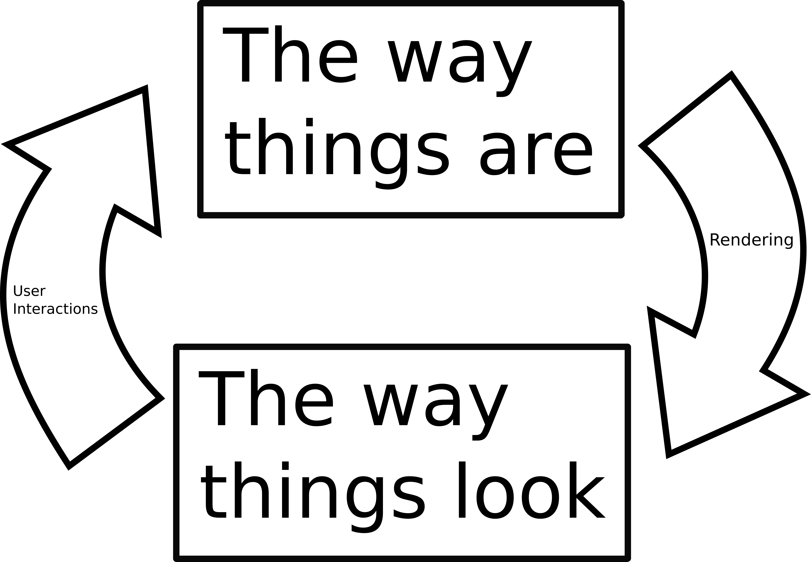
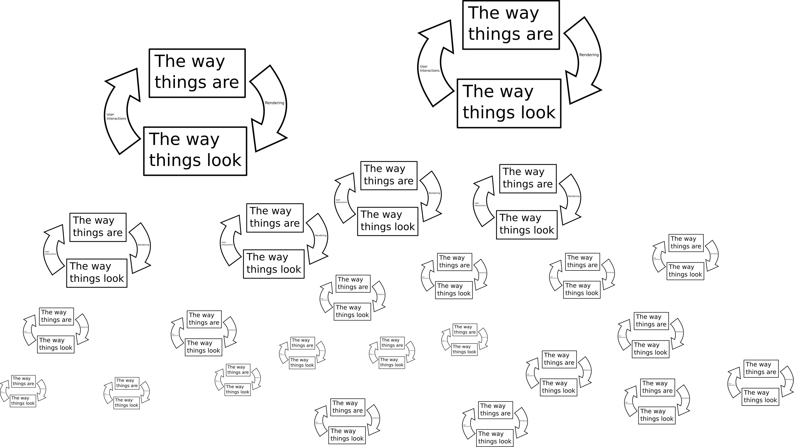
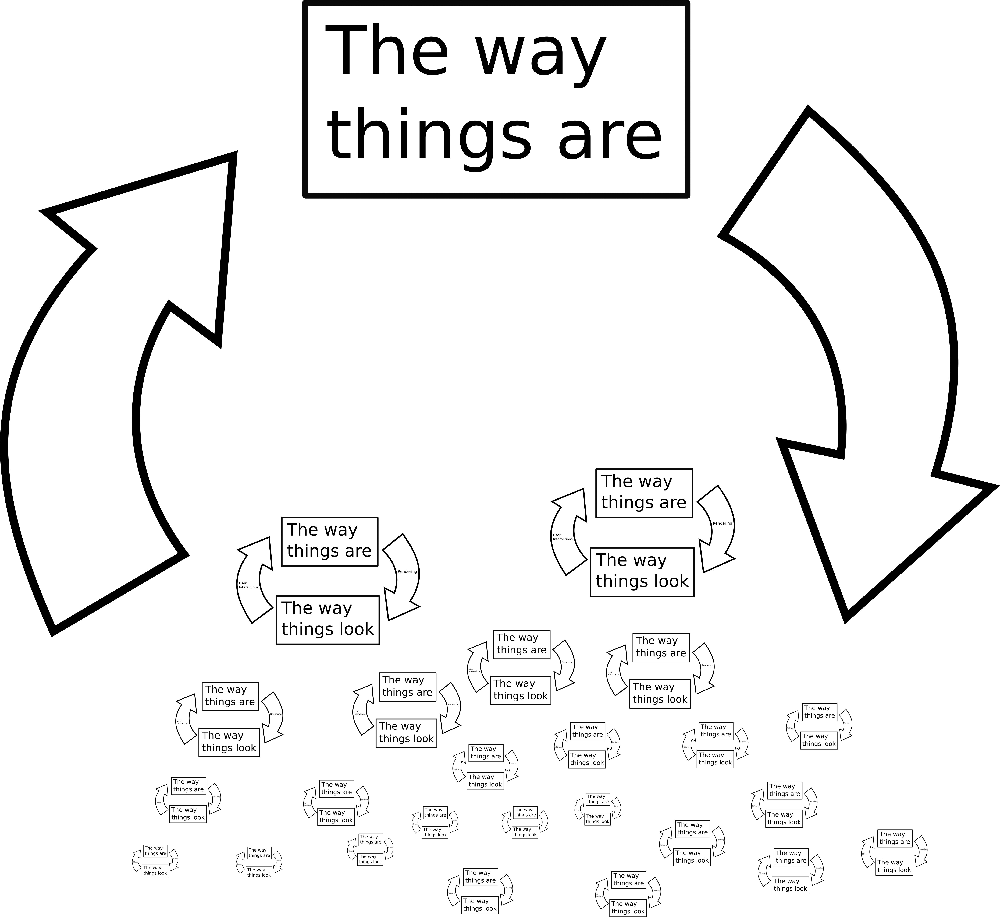

% React is a Leaky Abstraction
% Daniel Waterworth
% February 27, 2018

React is a Javascript UI framework produced by Facebook. It originally
was developed to help deal with UI complexity in Facebook. A goal which
they have acheived to some extent.

However, React is no panacea. Let me show you why.

A good way to structure UIs is as follows:

The way the application looks is generated from its state in a process
called rendering and when users interact with the look of things, they
trigger events which change the application state.

This is how games work and it is a good way to make understandable
applications.

This is also the structure that React is aspiring to. Unfortunately,
React exists within web browsers and web browsers have DOM elements.

Each element has its own state and its own look. These aspects are
linked, so it has its own cycle. Text boxes, for example, have focus,
text, selection, view position, etc and not all of this state can be
read and written to from javascript.

So, applications in the browser look like this:

This is obviously much more complicated and more difficult to
understand.  React, attempting to rectify this situation, doesn't/can't
divide DOM elements into their look and their state. So, React
applications end up looking like this:

This is a far cry from the original vision. What makes this worse
is that updates to the DOM happen implicitly based on virtual DOM
diffing. So now, since DOM nodes are special snowflakes, in order to
understand your application, you have to understand the details of how
this happens.
