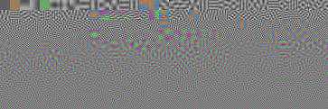

% What's wrong with autoencoders?
% Daniel Waterworth
% August 31, 2016

An autoencoder is an artificial neural network that is trained to reconstruct training samples by encoding and
decoding them. Typically, the inner most layer of the network is narrow. This forces the network to compress the
the data, rather than just copying it. More information can be found on the
[wikipedia page](https://en.wikipedia.org/wiki/Autoencoder).

As noted on that page, for a single layer network (which is a linear model), the optimal solution is to do PCA on
the input samples and to use the most prominent components as the neuron weights. So, what does an optimal single
layer autoencoder look like for natural image patches? Well, if we do PCA on a large sample set, we get
something like this:

As you can see, the most prominent filters (those at the top on the left), encode low frequency features and as
we go from prominent to less prominent filters the frequency increases.

So, an optimal single layer autoencoder will discard an image's high-frequency information. This explains why
autoencoders invariably produce blury outputs. **Whenever you optimize for reducing the sum-squared error in pixel
intensities, you will find the same effect**. The high-frequency information in images is just not interesting
from a sum-squared error point of view.

The upshot of this is, if you want to produce sharper results from an autoencoder, you'll need to find a
different objective function to minimize.
